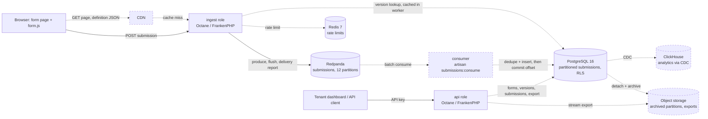

# Architecture

**How to read this.**
- Ten-minute review: §1, the two diagrams (§3, §4), §5, §11.
- The answer is all here: components and data flow (§3, §4), each requirement and how it is met (§5), the data model and its reasoning (§6), technology choices (§8), failure modes (§9), built versus designed (§11).
- The proof is in [DESIGN-NOTES.md](DESIGN-NOTES.md): which test proves what, the break-tests, the full built table with code and test paths, the dashboard auth narrative, the validation detail.
- The three decisions that shape everything are in [TRADEOFFS.md](TRADEOFFS.md).
- The code is under `app/`, `resources/js/`, `database/migrations/` and `tests/`; [DESIGN-NOTES.md §2](DESIGN-NOTES.md#2-built-code-and-test-paths) maps each built area to its files.
- Every measured number names the command that produced it; nothing here is a benchmark.

Version 1. Capacity figures in §2 are assumptions and labelled so. The only measured numbers are in "Measured results" below §2 and in §5.1/§5.2; each names the command that produced it. They come from one laptop, not a benchmark.

## 1. Overview

A multi-tenant webform service. Tenants author form definitions through an API-key-authenticated control plane (`api` role: forms, drafts, publish, submission list, CSV export, and a session dashboard — self-service signup, password or key login, form builder, submissions viewer, API key management — on the same role). The public data plane (`ingest` role) serves the form page and versioned definition JSON, validates submissions, and writes each accepted one to a Redpanda topic before returning 202. A consumer process drains the topic into PostgreSQL in batches, deduplicating on the client-generated id. Both HTTP roles run the same image with a different `APP_ROLE` on different origins, so a public burst cannot starve the dashboard and the control plane is unreachable from the public origin.

## 2. Assumptions and capacity

| Quantity | Value | Label |
|---|---|---|
| Tenants | 500 | assumption |
| Forms per tenant | 20 (10,000 total) | assumption |
| Steady submission rate | 20/s | assumption |
| Burst | 2,000/s for 10 minutes, one or a few forms, once per day | assumption |
| Payload | 2 KB validated `data` + 0.5 KB `meta` = 2.5 KB stored | assumption |
| Definition size | up to 100 fields, ~30 KB JSON | assumption |
| Retention | 13 months online, then archive | assumption |

Derived, line by line:

- Steady rows/day = 20/s × 86,400 s = 1,728,000.
- Burst rows/day = 2,000/s × 600 s × 1 burst = 1,200,000.
- Rows/day = 1,728,000 + 1,200,000 = 2,928,000 ≈ 2.9 M.
- Heap/day = 2,928,000 × 2.5 KB = 7,320,000 KB ≈ 7.3 GB.
- Indexes (primary key, tenant/form/time, GIN) at an assumed 50% overhead: 7.3 × 1.5 ≈ 11 GB/day.
- Storage/year = 11 GB × 365 ≈ 4.0 TB; rows/year = 2,928,000 × 365 ≈ 1.07 B. Monthly partitions of ≈ 330 GB are the unit of archival.
- Steady broker ingress = 20/s × 2.5 KB = 50 KB/s; daily-burst ingress = 2,000/s × 2.5 KB = 5 MB/s, 15 MB/s of cluster write traffic at RF=3 (designed). Bandwidth is not the constraint; fsync latency at `acks=all` is. Measured end-to-end ack latency at 200/s sustained: p50 9 ms, p99 21 ms (below).
- Definition reads are served from the CDN (designed) with `immutable`, so `ingest` read load is bounded by cache misses.

### Burst envelope

Ingest and the broker scale horizontally and are sized for the spike; PostgreSQL is sized for the consumer drain rate, and the topic is the buffer between the two. With ingress rate `R` for duration `T`, steady rate `S`, and consumer drain rate `D` (measured: ≥ 24,000 rows/s on the dev laptop, `make drain`; the consumer batches 500 rows per transaction, so `D` is bounded by PostgreSQL write throughput and the poll/commit loop, not by broker reads):

- ingest instances = ⌈R / per-instance rate⌉ — per-instance ack capacity is not measured: at the time of the runs the per-form bucket (then 2,000 burst, 200/s sustained; now 5,000 / 2,000 as an abuse ceiling) was the binding limit, so measuring it needs load spread over many tenants and a re-run
- backlog = (R − D) × T while both run; with `D` ≥ 2× the assumed 10,000/s spike, a live consumer builds no backlog at all — the topic is a buffer for *outages*, not for throughput
- backlog after a consumer outage of `X` seconds = R × X; drain time = R × X / (D − S)
- requirement: topic retention ≫ drain time, and `D > S` with margin or the backlog never clears

Worked example (assumptions: R = 10,000/s, S = 20/s, consumer down for X = 600 s; measured D = 24,000/s, taken conservatively as 20,000/s for a shared production database):

- backlog = 10,000 × 600 = 6,000,000 rows
- drain time = 6,000,000 / (20,000 − 20) ≈ 300 s ≈ 5 minutes after the consumer returns
- topic retention 7 days = 604,800 s, about 2,000× the drain time: requirement met
- broker ingress during the spike = 10,000/s × 2.5 KB = 25 MB/s; at RF=3 that is 75 MB/s of cluster write traffic (25 leader + 50 replication) and 15 GB of spike data per replica, 45 GB across the cluster
- the dashboard lags by up to the drain time; nothing is lost, because every 202 was preceded by a broker fsync

### Measured results (local dev — not a benchmark)

Hardware: one MacBook (Apple M4, 16 GB), Docker Desktop VM with 10 CPUs / 8 GB, every service on that one node, Redpanda single broker RF=1, `write_caching=false`. Generator (`loadtest/`, Node 22) runs inside the same VM. Numbers are from `make load`, `make chaos` and `make drain` on 2026-09-12; the raw per-request JSONL and summaries are in `loadtest/out/` (gitignored). Treat them as "this design works and here is roughly where the local limits are", not as production capacity.

| Run (command) | Sent | Acked (202) | Refused | Ack latency p50 / p95 / p99 / max (incl. retries) | Reconcile |
|---|---|---|---|---|---|
| Within limits: `make load ARGS="--spike 200 --spike-secs 120 --ramp 5 --post 10"` | 25,500 | 25,500 | 0 | 9 / 15 / 21 / 105 ms | 25,500 stored, 0 missing, 0 phantoms, 0 duplicates |
| Default spike: `make load` (2,000/s × 60 s), under the then per-form bucket of 2,000 / 200/s | 140,691 | 82,215 | 58,476 (all 429) | 2,278 / 8,954 / 9,278 / 10,325 ms | 82,215 stored, 0 / 0 / 0 |
| Chaos: `make chaos` (300/s × 150 s; consumer, Postgres, Redpanda stopped in turn; consumer process `kill -9`) | 48,500 | 33,318 | 15,182 (429: 13,640; 503: 764; network: 778) | 1,238 / 14,665 / 30,133 / 38,411 ms | 35,007 stored, 0 missing, 0 phantoms, 0 duplicates; 1,689 refused-but-stored |
| Drain: `make drain N=60000` | 60,000 produced at 7,170/s (each produce+flush+report) | — | — | — | 60,000 rows in 2.5 s → D ≥ 24,000 rows/s |

What each row means — the clean run, the spike refused by the limiter of the time, the chaos run and the drain — is unpacked in [DESIGN-NOTES.md §1](DESIGN-NOTES.md#1-measured-results-what-the-rows-mean).

## 3. Component diagram

Solid edges exist in the repository. Dashed edges and dashed nodes are designed only.



## 4. Submission lifecycle

```mermaid
sequenceDiagram
    participant C as Browser
    participant I as ingest (Octane worker)
    participant R as Redpanda
    participant K as consumer
    participant P as PostgreSQL

    C->>I: GET /f/{form} (page + HMAC render token, definition as a JSON data block)
    I->>I: VersionStore: worker LRU -> Redis -> PostgreSQL (I12)
    I-->>C: 200, CSP, nosniff, no-store
    C->>C: client validation (same conformance rules); id = UUIDv7, kept in localStorage until acked
    C->>I: POST /v1/forms/{form}/submissions {submission_id, form_version_id, render_token, data, honeypot}
    I->>I: 1 rate limits (Redis buckets, per-worker fallback) -> 429
    I->>I: 2 honeypot / token HMAC, age 2s..24h -> decoy 202, logged, never produced (I13)
    I->>I: 3 version belongs to form and is current or superseded < 24h -> 404 / 409 (I3)
    I->>I: 4 visibility -> strip hidden -> strict checks against that version (I6, I7)
    alt validation fails
        I-->>C: 422 {field: [codes]}
    end
    I->>I: received_at = now (fixed here); envelope {v, ids, received_at, data, meta{ip_hash, ua, referer host}}
    I->>R: produce(key=submission_id, envelope) — local queue only (I14)
    I->>R: flush(bounded timeout)
    R-->>I: delivery report, err = 0
    Note over R: durability begins here: record fsync'd by the leader with acks=all (RF=3 designed: on 2 of 3 replicas)
    I-->>C: 202 {submission_id, received_at}
    C->>C: clear localStorage, show thanks
    alt broker slow or down
        R--xI: no report within message.timeout.ms (after N failures the breaker answers without trying)
        I-->>C: 503 Retry-After
        C->>I: retry with the same id (backoff + jitter, Retry-After honoured, survives a reload)
        I->>R: produce, flush, report
        I-->>C: 202
        Note over R,P: if the first produce did land, the topic now holds the id twice
    end
    R->>K: batch: up to 500 records or 200 ms (enable.auto.commit=false)
    K->>K: envelope check only (v, ids, received_at); malformed -> submissions.dlq with a reason header
    K->>K: dedupe ids inside the batch (a multi-row INSERT can't ON CONFLICT against itself)
    K->>P: BEGIN; INSERT submission_ids ON CONFLICT DO NOTHING RETURNING id
    K->>P: INSERT submissions only for returned ids, one statement; COMMIT
    Note over K,P: duplicate ids collapse here (I2); received_at is the envelope's, never now()
    K->>R: commit offsets (only after COMMIT)
    alt PostgreSQL down
        K->>K: retry the same batch from memory with backoff (0.5 s .. 30 s); offsets untouched
    end
```

The ambiguous ack is the case that matters: the client cannot tell "not produced" from "produced, report lost". Both resolve the same way because the retry reuses the id and `submission_ids` is a global unique key.

Reads before the submit: `GET /v1/forms/{form}/versions/{version}` is `Cache-Control: public, max-age=31536000, immutable` (versions never change), `GET /v1/forms/{form}` is `max-age=30, stale-while-revalidate=60`, and `GET /f/{form}` is `no-store` because it embeds a per-render token. Designed: a CDN-cacheable page shell plus a tiny token endpoint, so the HTML itself becomes cacheable and only the token round-trips to `ingest`.

The order of checks is by cost: rate limits touch only Redis (or worker memory), the token check is a local HMAC, version resolution reads the form state the page load already cached, and only then does validation and the broker round-trip happen.

The consumer (`submissions:consume`, role `webform_writer`) is the only writer of `submissions`. Its two commits are ordered on purpose: database first, offsets second. A crash between them replays the batch, and `submission_ids` rejects every id it already holds — that replay is the exactly-once proof in [tests/Feature/Consumer/ConsumerTest.php](tests/Feature/Consumer/ConsumerTest.php). The reverse order would lose rows. Poison is handled at two levels without ever blocking a partition: a malformed envelope goes to `submissions.dlq` with the original bytes and a `reason` header before its offset advances; a row the schema refuses (SQLSTATE 23xxx) makes the batch fall back to row-by-row so the good rows land and the bad one is dead-lettered. A database outage is the opposite case: the batch is retried from memory with capped exponential backoff and nothing is skipped.

## 5. Requirements

### 5.1 Bursty load

Mechanism: no database write on the request path; the only synchronous dependency is the broker ack. Octane keeps the framework booted, a per-worker `Producer` singleton keeps broker connections open, and the message key is the submission id so a hot form spreads across all 12 partitions (I14). Per-worker singletons are resolved at worker boot through Octane's `warm` list: a singleton first resolved inside a request belongs to that request's sandbox container and does not survive it — found on the running stack when the breaker failed to open, not by the test suite. Backpressure is explicit: no ack within `message.timeout.ms` means 503 + `Retry-After`, never a queued-in-memory 202.
Evidence: the producer, the breaker (open, probe, close, re-open on a failed probe, fatal recreate) and the HTTP path returning 503, never 202, while the broker is down — see [DESIGN-NOTES.md §3.1](DESIGN-NOTES.md#31-bursty-load). Measured (§2, "Measured results"): 200/s sustained for 120 s on one form, 25,500/25,500 acked, p50 9 ms, p99 21 ms end to end; a 2,000/s spike on one form was refused by the per-form bucket of the time (532,326 × 429; defaults since raised, not re-run), and the consumer drains ≥ 24,000 rows/s.

### 5.2 No lost submissions

Mechanism (I1, I2): `produce()` only enqueues locally, so `send()` calls `flush()` with a bounded timeout and then reads this message's own delivery report by opaque token; any error, timeout or missing report throws `DeliveryFailed` → 503. No code path returns 202 without a clean report. Producer: `acks=all`, `enable.idempotence=true`, bounded `message.timeout.ms`. `redpanda-init` forces `write_caching_default=false` and refuses to start the stack otherwise, so an ack means fsync. The consumer commits offsets only after its transaction commits; a crash in between replays the batch and `submission_ids` collapses it.
Evidence: 202 only after the exact envelope is on the topic, 503 with nothing acked while the broker is down, decoys produce nothing but are logged, the client retries with the same id, and the consumer replay collapses duplicates — see [DESIGN-NOTES.md §3.2](DESIGN-NOTES.md#32-no-lost-submissions). Reconciliation (`loadtest/reconcile.mjs`, §2 "Measured results"): across a clean 25,500-request run, a 140,691-request run with 58,476 refusals, and a chaos run with the consumer stopped, PostgreSQL stopped, Redpanda stopped and the consumer process killed, every acked id was stored, no stored id was unsent, and no id was stored twice. "Sent but not acked" ids are refused (429/503), not lost: no 202 was ever issued for them, and the 1,689 that the chaos run stored anyway are the ambiguous-ack case collapsing as designed.

### 5.3 Tenant isolation

Mechanism (I11), three layers: tenant resolved from the API key hash in middleware and bound with `app()->scoped()`, which Octane resets per request (a singleton would leak the previous tenant into the next request on the same worker); a tenant global scope on every Eloquent query; PostgreSQL RLS `ENABLED` on every table holding tenant data, with the tenant set by `set_config('app.tenant_id', ?, true)` per transaction (a session-level `SET` would outlive the request on a reused connection). Each process connects as its own non-superuser role and gets only its policies; nothing uses `BYPASSRLS`:

| Role | Used by | Grants | Policy |
|---|---|---|---|
| `webform_owner` | migrations, tests | owns everything | none — never a runtime role, enforced by `RuntimeRole` |
| `webform_api` | `api` | S/I/U `forms`, S/I `form_versions`, S `submissions`, S/I `tenants`, S/I `tenant_users`, S (all but `key_hash`)/I/U (`revoked_at`) `api_keys`, S/I/U `users` (no RLS: not tenant data), EXECUTE `resolve_api_key`, `resolve_user_tenants` | `tenant_id = NULLIF(current_setting('app.tenant_id', true), '')::uuid` (`tenants`: `id = …`), `USING` and `WITH CHECK`; unset → zero rows |
| `webform_ingest` | `ingest` | S `forms (id, tenant_id, status, current_version_id)`, S `form_versions` | form `status = 'published'`, any tenant; the draft column is not granted |
| `webform_writer` | consumer | I `submissions`, I + S(id) `submission_ids` | `WITH CHECK (true)` on insert; cannot read submissions |

RLS is `ENABLED`, not `FORCED`, and the owner role is kept out of the runtime by credentials and a boot-time role check rather than by an allow-all policy; on the API side `AuthenticateApiKey` resolves the key, binds the tenant with `app()->scoped()` and wraps the request in one transaction that starts with `set_config` — the detail, including why `FORCE` would restrict nothing here, is in [DESIGN-NOTES.md §3.3](DESIGN-NOTES.md#33-tenant-isolation).

The dashboard is a second way into the same tenant context, not a second identity model: a session started by email + password or by an API key holds ids only, and `DashboardTenant` hands the session's `tenant_id` to the same `TenantTransaction` a bearer request uses, re-reading the membership row inside it on every request. Self-service signup creates user, tenant, owner membership and first key in one transaction; API keys can be listed, created and revoked from the dashboard, and `resolve_api_key` — the only code that sees a key hash — ignores revoked keys. The session model, signup and verification, and the key lifecycle are in [DESIGN-NOTES.md §4](DESIGN-NOTES.md#4-dashboard-authentication).
Evidence: each role on its own connection against real PostgreSQL, the middleware's scoped rebinding and fail-closed transaction, 404 for another tenant's form on every API and dashboard route, a session cookie never authenticating `/v1` and a key never authenticating `/dashboard`, signup atomicity, membership removal taking effect on the next request, revoked keys refused — plus the break-tests that were run — see [DESIGN-NOTES.md §3.3](DESIGN-NOTES.md#33-tenant-isolation).

### 5.4 Correctness under failure

Mechanism (I12): every dependency has a defined degraded mode (section 9). Ingest may degrade to "accept and buffer", never to "accept and drop": Redis down → the rate limiter falls back to per-worker buckets and logs once a minute, the version store falls through to PostgreSQL; PostgreSQL down → ingest keeps serving from its version store; broker down → 503 with nothing acked, breaker open; consumer down → the topic absorbs the backlog. The version store ([app/Ingest/VersionStore.php](app/Ingest/VersionStore.php)) reads versions through a bounded per-worker LRU (workers are recycled by `--max-requests`, so memory alone is not enough), then Redis (no expiry; versions are immutable), then PostgreSQL, filling Redis on the way back. Form state (`status`, `current_version_id`, the versions list I3 needs) is cached 10 s in the worker and 60 s in Redis, and served stale from the worker when PostgreSQL errors. Publish writes both keys after its commit, so a fresh version is servable at once and the store is already warm if the database goes away before anyone reads it; a Redis failure there is logged, not fatal. Only a cold key with both PostgreSQL and Redis unreachable yields 503 + `Retry-After`.
Evidence: pages and definitions keep serving after PostgreSQL goes away, a cold key with both stores down is a 503, publish pre-warms Redis and survives Redis being down, the rate limiter falls back per worker — see [DESIGN-NOTES.md §3.4](DESIGN-NOTES.md#34-correctness-under-failure).

### 5.5 Version integrity

Mechanism (I3, I4, I5): publish creates an immutable `form_versions` row (trigger raises on UPDATE/DELETE); a submission names the version it was rendered against and is validated against it, accepted while current or superseded < 24 h ago, else 409 with the current version id; field ids are server-generated `^[a-z0-9_]{1,40}$`, and a publish that changes an existing id's type is rejected (`PublishCompat`). `Cache-Control: immutable` on definition JSON is safe only because of this.
Evidence: the id regex, the immutability trigger, the composite version FK, the `PublishCompat` fixtures (an id deleted in v2 and re-added in v3 keeps its type) and type-change rejection over HTTP — see [DESIGN-NOTES.md §3.5](DESIGN-NOTES.md#35-version-integrity).

### 5.6 XSS and injection

Mechanism: definitions validated at save (`DefinitionRules`: id shape, types, options, rule values, regex portability); the page renders with `{{ }}` only and embeds the definition as a `<script type="application/json">` data block — never executed, so the CSP allows it, and `@json` hex-escapes `< > & ' "` so no value can close it; `render.js` uses `textContent`/`setAttribute`, never `innerHTML`, and never builds markup from strings; every public response carries `default-src 'none'; script-src 'self'; style-src 'self'; …; worker-src 'self'; base-uri 'none'; frame-ancestors *` (embeddable by design, so no `X-Frame-Options`), `nosniff` and `Referrer-Policy: no-referrer`, and JS/CSS are same-origin Vite builds with nothing inline (I9); the public origin carries no credential for the control plane. The dashboard carries the same CSP with `frame-ancestors 'none'` — it holds a session cookie, so it must not be framable — and the same discipline: builder state in a `<script type="application/json">` data block, the editor and the live preview built with `createElement`/`textContent`/`setAttribute` only, error messages from a code → message map, never from server strings. CSV export prefixes cells starting with `= + - @`, tab or CR with `'` (I10). Customer regex runs only through `SafePattern` (I8, section 7).
Evidence: hostile labels, help text, form names and submitted values render inert on the public page and in the dashboard, the exact headers are on every public response including 404s, and a pathological pattern is bounded — see [DESIGN-NOTES.md §3.6](DESIGN-NOTES.md#36-xss-and-injection).

### 5.7 Dynamic-schema storage

Mechanism: one `submissions` table for all tenants and forms, answers in JSONB `data` keyed by stable field id, `form_version_id` pointing at the definition that gives the keys meaning (section 6). Reading it back: `GET /v1/forms/{form}/submissions` is keyset-paginated on `(received_at DESC, id DESC)` — the index order — with `from`/`to`, `version_id` and an exact `field`/`value` match as `data @> {...}`; `export.csv` streams the same query in keyset chunks of 1,000 (I15) inside its own transaction with the tenant set (the middleware's ended before the stream ran, I11). Export columns are the union of field ids over every version, headed by each id's most recent label, so a row from v1 still exports correctly after v2 renamed, deleted and added fields — that is what I5 buys. Cells starting with `= + - @`, tab or CR get a leading apostrophe (I10); quoting is RFC 4180.
Evidence: partitions with the DEFAULT fallback, the stored shape fixed by the validator, keyset paging without repeat or skip through same-microsecond ties, export across a rename/delete/add with a bounded peak, and the viewer agreeing with the export and the API — see [DESIGN-NOTES.md §3.7](DESIGN-NOTES.md#37-dynamic-schema-storage). On the running stack the export of a 171,827-row form (26.8 MB) started streaming after 6 ms and finished in 1.0 s (`curl -w`, §2 hardware).

## 6. Data model

```
tenants(id, name)
api_keys(id, tenant_id, key_hash, created_at)
forms(id, tenant_id, name, draft jsonb, current_version_id, status)
form_versions(id, form_id, tenant_id, version_no, definition jsonb, published_at)   -- immutable
submissions(id uuid, tenant_id, form_id, form_version_id, data jsonb, meta jsonb, received_at)
    PARTITION BY RANGE (received_at), PRIMARY KEY (id, received_at)
    FK (form_version_id, form_id, tenant_id) -> form_versions (id, form_id, tenant_id)
submission_ids(id uuid PRIMARY KEY, received_at)
```

Built as raw SQL in three migrations (`database/migrations/2026_09_11_*`). UUIDs are generated by the application. `form_versions` has `UNIQUE (id, form_id, tenant_id)` so a submission's composite FK ties it to a version of its own form and tenant (I3); a `BEFORE UPDATE OR DELETE` trigger makes versions immutable (I4). `forms.current_version_id` is a nullable FK back to `form_versions`, which resolves the circular reference: form, then version, then pointer.

**JSONB with stable ids, not EAV or table-per-form.** EAV multiplies rows by field count and turns "show one submission" into a pivot. Table-per-form means DDL on publish, ten thousand tables with their own RLS and indexes, and a migration per version. JSONB keeps one row per submission and one schema; `form_versions.definition` is the schema for reading each row. The cost: per-field range queries are not indexable in general (see the limit below).

**Partitioning.** `submissions` is range-partitioned by `received_at` (monthly, `submissions_YYYY_MM`): retention is `DETACH PARTITION` + archive, not a bloating `DELETE`. `submissions:ensure-partitions` (idempotent, run by the `migrate` service and later by a scheduler) keeps the current and next two months created; a `DEFAULT` partition catches anything outside them, because a failed insert of an already-acked submission would be data loss — a row landing there is an alert, not an error. `received_at` comes from the message (set by ingest at acceptance), never `now()` in the database, so a replayed batch lands in the same partition. A partitioned table's unique constraints must include the partition key, so `id` alone cannot be unique there; `submission_ids` is a small unpartitioned table whose primary key is the global dedupe point (I2), carrying `received_at` so it is pruned in step. It holds no tenant data and has no RLS.

**Indexes and the query each serves.**

| Index | Query |
|---|---|
| `submissions PK (id, received_at)` | fetch one submission; partition-local uniqueness |
| `submission_ids PK (id)` | consumer `INSERT ... ON CONFLICT DO NOTHING RETURNING id` |
| `submissions (tenant_id, form_id, received_at DESC, id DESC)` | dashboard list and CSV export, keyset paginated on `(received_at, id)`; `received_at` is server-set, so ordering by it is monotonic where the client-generated id is not. Also carries the filtered list: see the RLS note below |
| `GIN (data jsonb_path_ops)` | exact-match filter `data @> '{"field": "value"}'` — usable only by a role that bypasses RLS (see below) |
| `api_keys (key_hash)` | auth lookup |

**The honest limit, part one: the GIN index is invisible to the api role.** `EXPLAIN ANALYZE` as `webform_api` (tenant set) for `... and data @> '{"name": "Unique Zebra"}' order by received_at desc, id desc limit 51` on a 171,827-row form: `Index Scan using submissions_2026_09_tenant_id_form_id_received_at_id_idx … Filter: (data @> …) Rows Removed by Filter: 171826`, 27 ms; the same predicate as the superuser: `Bitmap Index Scan on submissions_2026_09_data_idx`, 0.07 ms. No seq scan either way, but the api role never gets the GIN plan: PostgreSQL evaluates only `LEAKPROOF` operators before a row-security qual, and jsonb `@>` is not leakproof, so under RLS it can only run as a filter after the (leakproof) uuid equality on the btree. A filtered list therefore costs a btree walk over the form's rows — linear in form size, sub-100 ms at 172k rows here, and the same for any tenant because the btree narrows to (tenant, form) first. Options, none taken yet: a `SECURITY DEFINER` read function that applies the tenant predicate itself and is allowed the GIN plan; or accepting the walk and pushing analytics to the designed path below.

**The honest limit, part two.** `jsonb_path_ops` serves containment only; "age > 30" over `data` is a partition scan narrowed by tenant and form. Fine for one form's recent partition, not an analytics product. Designed answer: CDC into ClickHouse with `data` exploded into typed columns per version; PostgreSQL stays the system of record.

## 7. Validation design

A definition is validated twice: `resources/js/form/validate.js` in the browser for feedback, `App\Forms\SubmissionValidator` on ingest as the authority. Both run against `conformance/`: each case states definition, input, expected error codes per field, and the exact object to store. Codes, not messages, so the two implementations are compared mechanically. Both pass every case: `tests/js/validate.test.mjs` runs all submission cases through `validate.js` and asserts `valid`, `errors` and `output` exactly — that is the parity proof.
Why Laravel's Validator was not used, how customer regex is contained, and the JS/PCRE semantic gaps that remain are in [DESIGN-NOTES.md §5](DESIGN-NOTES.md#5-validation-design-detail).

## 8. Technology choices

| Component | Choice | Why | Rejected alternative |
|---|---|---|---|
| Runtime | PHP 8.4, Laravel, Octane on FrankenPHP | Persistent workers remove per-request boot; the ingest hot path is a few hundred lines of pure PHP plus one broker round trip, so it scales horizontally on cheap CPU; Laravel pays off in the control plane (auth, routing, Blade) | Go/Node ingest: faster per core, but a second codebase for the same rules; the conformance suite makes parity a test, not a language choice |
| Buffer | Redpanda (Kafka API), `write_caching=false` | Durable, replayable buffer; partitions give parallel consumers; Kafka API keeps a managed cluster possible. Write caching (on by default in the image's developer mode) acks before fsync and would silently break I1, so the init job forces it off and asserts it | Direct PostgreSQL insert: couples ingest to the database; Redis Streams: weaker replication |
| Producer | `rdkafka` + thin `App\Kafka\Producer` | Delivery reports and flush are the whole of I1; a wrapper would hide them | `mateusjunges/laravel-kafka` |
| Database | PostgreSQL 16 | JSONB, range partitioning, RLS, `ON CONFLICT` | MySQL: no RLS, weaker JSON indexing |
| Rate limiting | Redis 7 via `RateLimiter`, fail-open | Shared counters across instances; limiter failure must not fail ingest | Per-instance counters |
| Validation | Pure PHP + JS, shared fixtures | Exact parity, strict types | Laravel Validator (section 7) |
| Tests | Pest on real PostgreSQL and Redpanda | SQLite lacks JSONB, RLS, partitions; a mocked broker makes I1 untestable | SQLite in-memory |
| Form page | Blade + vanilla JS via Vite | One page; CSP-friendly | SPA framework |

## 9. Failure modes

| Failure | System behaviour | User-visible effect | Recovery |
|---|---|---|---|
| Redpanda down or slow | No clean report within `message.timeout.ms` → 503 + `Retry-After`; nothing acked. After N consecutive failures the per-worker breaker answers 503 immediately for a cooldown, then probes | The page keeps the submission in localStorage and retries with the same id (backoff, Retry-After); the user sees "kept on this device" | Broker returns; probe succeeds; duplicates collapse in `submission_ids` |
| PostgreSQL down | Ingest serves pages and definitions from the version store (worker LRU, then Redis; publish pre-warms both); form state is served stale; the consumer retries its in-flight batch with backoff and commits no offsets, so the topic absorbs the backlog; `api` 503. A cold `ingest` instance still starts (role check deferred to first connection) and serves anything Redis holds; only a key in neither cache returns 503 + `Retry-After` | Published forms keep working; dashboard down; a form never read since its publish *and* evicted from Redis is unavailable until the DB returns | Consumer drains; nothing was acked without a broker fsync. In production the version keys move to object storage behind the CDN, so Redis is not the only Postgres-independent copy |
| Redis down | Rate limiter switches to per-worker buckets and logs once a minute; version store falls through to PostgreSQL; publish still succeeds | None; spam limits weaken to per-worker; slightly more DB reads on ingest | Shared counters resume; read-through refills the store |
| Consumer down | Topic retains; lag grows (logged per batch) | Submissions appear late | `restart: unless-stopped` (tini as PID 1 so a process crash exits the container); resumes from the last committed offset; the replayed batch collapses in `submission_ids`. Measured: a crashed member's partitions come back after ≈ 45 s (`session.timeout.ms`), then 60,000 rows drain in 2.5 s |
| Poison message | Malformed envelope → `submissions.dlq` + reason header, offset advances; schema-rejected row → row-by-row fallback, offender dead-lettered | None; the DLQ is the operator's queue | Inspect the DLQ; the original bytes are intact |
| One ingest instance down | Removed from the balancer; in-flight requests without a report are unacked | A few network errors; clients retry with the same id | Autoscaling replaces it (designed) |
| CDN down (designed) | Page and definition requests fall through to `ingest` | Slower loads | `immutable` responses refill |
| Redpanda disk full | Produces fail → 503 | As broker down | Retention or capacity change |

## 10. Production deployment (designed)

- Redpanda: three brokers in three availability zones, `submissions` RF=3, `min.insync.replicas=2`, `acks=all`, write caching off. One broker loss keeps writes flowing; two stop ingest with 503s rather than silent loss.
- Ingest: stateless Octane pods behind a load balancer, autoscaled on CPU and p99 ack latency. Page and definition JSON via CDN: `immutable` on versioned URLs, short max-age on the current-version pointer. `TRUSTED_PROXIES` names the load balancer/CDN ranges so `X-Forwarded-For` yields the visitor IP for the per-IP bucket; unset, the socket IP is used and every visitor behind a proxy would share one bucket.
- Consumers: at most one per partition, so scaling stops at 12 without repartitioning; batch size and commit interval: TBD (load test).
- Noisy neighbours: per-tenant rate limits at ingest; Kafka quotas per producer principal; large tenants move to a dedicated topic and consumer group — a routing change, not a schema change.
- Retention: topic retention covers the longest tolerated consumer outage (assumption: 7 days). Monthly partitions older than 13 months are detached and archived to object storage as Parquet; `submission_ids` pruned in step.
- Analytics: CDC (logical replication) into ClickHouse for range and aggregate queries over `data`.

## 11. Built vs designed

"Built" means the code and the tests that exercise it are in this repository today; nothing else qualifies.

### Built

Built, with code and tests in this repository ([DESIGN-NOTES.md §2](DESIGN-NOTES.md#2-built-code-and-test-paths) has the table of paths): the runtime and compose stack; the producer with ack-after-durability and the circuit breaker; the public submission path with rate limits, spam decoys, version pinning and validation; definition and submission validation with the shared conformance fixtures and publish compatibility; the partitioned schema, the four least-privilege roles, row-level security and the runtime role check; the control plane — keys, forms, drafts, publish, versions, submission list, streaming CSV export; the dashboard — signup, password or key login, per-request membership checks, form builder, submissions viewer, API key management; the version store, public definition endpoints and the server-rendered form page; the consumer with dedupe, offsets after commit and a DLQ; the client scripts; and the load, reconciliation, chaos and drain tooling.

### Designed, not built

- **CDN** in front of `ingest` for the page shell and `immutable` definition JSON (a cacheable shell plus a token endpoint; today the page is `no-store`).
- **ClickHouse via CDC** for range and aggregate queries over `data`; PostgreSQL stays the system of record.
- **Object storage** as the PostgreSQL-independent copy of published versions (Redis is the slice's stand-in) and as the home of archived partitions.
- **Multi-region**: not designed; single region is load-bearing for `min.insync.replicas` and RLS latency.
- **Per-tenant sharding**: dedicated topics and consumer groups for large tenants; Kafka client quotas.
- **Webhooks** on submission stored.
- **Transactional email**: verification links and the existing-account notice are log lines on `api`; a mail transport, templates and a resend cadence are not built. Password reset is not built either — it needs that transport.
- **Team management**: `tenant_users.role` has `owner|member` and every signup is an owner; inviting, removing and promoting members, and switching between tenants, are not built (the per-request membership check already covers removal).
- **GDPR deletion**: erasing a submission or a tenant across partitions, topic retention, the DLQ and exports.
- **Async exports to S3**: the CSV export is a synchronous stream; long exports would move to a job with a signed download URL.
- **Browser automation tests**: `render.js`, `patterns.js` and the submit flow are unit-tested and exercised with curl, never driven in a real browser.

### Known limits

- **RLS vs GIN.** The `webform_api` role cannot use the GIN index: jsonb `@>` is not `LEAKPROOF`, so a filtered list is a btree walk over the form's rows with the containment as a post-filter (§6).
- **No per-instance ingest capacity number.** The per-form bucket bound every run; measuring ingest itself needs load spread over many tenants.
- **Measurements are one laptop, single node, RF=1**, generator in the same VM (§2).
- **The builder is exercised over HTTP, not in a browser.** Its endpoints, escaping and error attribution are tested; the editor's DOM behaviour (move/remove, visibility editor, preview) was checked by hand only. The submissions viewer has no JavaScript, so its tests cover everything it does.
- **The submissions viewer is a walk, not a search.** It inherits the RLS-vs-GIN limit above: a field = value filter is a btree walk over the form's rows, and there is no free-text or range filter by design.
- **Crash recovery ≈ 45 s** for the consumer: Kafka's `session.timeout.ms` for the dead member before partitions are reassigned.
- **`TRUSTED_PROXIES` must be set per deployment**; unset, every visitor behind a load balancer shares one per-IP bucket.
- **JS has no regex backtrack limit**; mitigated by the Web Worker budget, not removed.

## 12. Open questions and next steps

1. Consumer batch shape: one transaction per poll batch vs per N records — replay size on crash vs transaction overhead. Measured locally: 500-row batches commit in 11–23 ms (`make drain`), so the batch size is not the bottleneck; not re-tuned.
2. Filtered lists under RLS: a `SECURITY DEFINER` read function that applies the tenant predicate itself and is allowed the GIN plan, or build the ClickHouse path first (§6).
3. 24 h superseded-version grace is an assumption; it bounds how long a stale tab can still submit.
4. Replace `\s` in accepted patterns with an explicit class to close the JS/PCRE gap, or leave it documented.
5. Multi-region is not designed; single region is load-bearing for `min.insync.replicas` and RLS latency.
