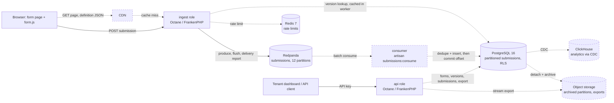

# Architecture

Version 1. Every capacity figure is an assumption; nothing here is measured. Values that need a load test are written "TBD (load test)".

## 1. Overview

A multi-tenant webform service. Tenants author form definitions through an API-key-authenticated control plane (`api` role: forms, drafts, publish, submission list, CSV export). The public data plane (`ingest` role) serves the form page and versioned definition JSON, validates submissions, and writes each accepted one to a Redpanda topic before returning 202. A consumer process drains the topic into PostgreSQL in batches, deduplicating on the client-generated id. Both HTTP roles run the same image with a different `APP_ROLE` on different origins, so a public burst cannot starve the dashboard and the control plane is unreachable from the public origin.

## 2. Assumptions and capacity

| Quantity | Value | Label |
|---|---|---|
| Tenants | 500 | assumption |
| Forms per tenant | 20 (10,000 total) | assumption |
| Steady submission rate | 20/s | assumption |
| Burst | 2,000/s for 10 minutes, one or a few forms, once per day | assumption |
| Payload | 2 KB validated `data` + 0.5 KB `meta` = 2.5 KB stored | assumption |
| Definition size | up to 100 fields, ~30 KB JSON | assumption |
| Retention | 13 months online, then archive | assumption |

Derived, line by line:

- Steady rows/day = 20/s × 86,400 s = 1,728,000.
- Burst rows/day = 2,000/s × 600 s × 1 burst = 1,200,000.
- Rows/day = 1,728,000 + 1,200,000 = 2,928,000 ≈ 2.9 M.
- Heap/day = 2,928,000 × 2.5 KB = 7,320,000 KB ≈ 7.3 GB.
- Indexes (primary key, tenant/form/time, GIN) at an assumed 50% overhead: 7.3 × 1.5 ≈ 11 GB/day.
- Storage/year = 11 GB × 365 ≈ 4.0 TB; rows/year = 2,928,000 × 365 ≈ 1.07 B. Monthly partitions of ≈ 330 GB are the unit of archival.
- Steady broker ingress = 20/s × 2.5 KB = 50 KB/s; daily-burst ingress = 2,000/s × 2.5 KB = 5 MB/s, 15 MB/s of cluster write traffic at RF=3 (designed). Bandwidth is not the constraint; fsync latency at `acks=all` is. Ack latency: TBD (load test).
- Definition reads are served from the CDN (designed) with `immutable`, so `ingest` read load is bounded by cache misses.

### Burst envelope

Ingest and the broker scale horizontally and are sized for the spike; PostgreSQL is sized for the consumer drain rate, and the topic is the buffer between the two. With ingress rate `R` for duration `T`, steady rate `S`, and consumer drain rate `D` (TBD (load test); the consumer batches inserts, so `D` is bounded by PostgreSQL write throughput, not by broker reads):

- ingest instances = ⌈R / per-instance rate⌉, per-instance rate TBD (load test)
- backlog = (R − D) × T
- drain time = backlog / (D − S)
- requirement: topic retention ≫ drain time, and `D > S` with margin or the backlog never clears

Worked example (assumption: R = 10,000/s for T = 600 s, S = 20/s; illustrative D = 3,000/s, not measured):

- backlog = (10,000 − 3,000) × 600 = 4,200,000 rows
- drain time = 4,200,000 / (3,000 − 20) ≈ 1,409 s ≈ 23.5 minutes
- topic retention 7 days = 604,800 s, about 430× the drain time: requirement met
- broker ingress during the spike = 10,000/s × 2.5 KB = 25 MB/s; at RF=3 that is 75 MB/s of cluster write traffic (25 leader + 50 replication) and 15 GB of spike data per replica, 45 GB across the cluster
- the dashboard lags by up to the drain time; nothing is lost, because every 202 was preceded by a broker fsync

## 3. Component diagram

Solid edges exist in the repository. Dashed edges and dashed nodes are designed only.



## 4. Submission lifecycle

```mermaid
sequenceDiagram
    participant C as Browser
    participant I as ingest (Octane worker)
    participant R as Redpanda
    participant K as consumer
    participant P as PostgreSQL

    C->>I: GET /f/{form} (page + HMAC render token, embedded definition)
    I-->>C: 200, CSP, nosniff
    C->>C: client validation (same conformance rules), id = UUIDv7
    C->>I: POST /f/{form}/v/{version} {id, data, token}
    I->>I: version pinned? token age ok? visibility -> strip hidden -> strict checks (I3, I6, I7)
    alt validation fails
        I-->>C: 422 {field: [codes]}
    end
    I->>R: produce(key=id, payload) — local queue only
    I->>R: flush(bounded timeout)
    R-->>I: delivery report, err = 0
    Note over R: durability begins here: record fsync'd by the leader with acks=all (RF=3 designed: on 2 of 3 replicas)
    I-->>C: 202 {id}
    alt broker slow or down
        R--xI: no report within message.timeout.ms
        I-->>C: 503 Retry-After
        C->>I: retry with the same id
        I->>R: produce, flush, report
        I-->>C: 202
        Note over R,P: if the first produce did land, the topic now holds the id twice
    end
    R->>K: batch of records (enable.auto.commit=false)
    K->>P: BEGIN; INSERT submission_ids ON CONFLICT DO NOTHING RETURNING id
    K->>P: INSERT submissions only for returned ids; COMMIT
    Note over K,P: duplicate ids collapse here (I2)
    K->>R: commit offsets (only after COMMIT)
```

The ambiguous ack is the case that matters: the client cannot tell "not produced" from "produced, report lost". Both resolve the same way because the retry reuses the id and `submission_ids` is a global unique key.

## 5. Requirements

### 5.1 Bursty load

Mechanism: no database write on the request path; the only synchronous dependency is the broker ack. Octane keeps the framework booted, a per-worker `Producer` singleton keeps broker connections open, and the message key is the submission id so a hot form spreads across all 12 partitions (I14). Backpressure is explicit: no ack within `message.timeout.ms` means 503 + `Retry-After`, never a queued-in-memory 202.
Evidence: [tests/Feature/Kafka/ProducerTest.php](tests/Feature/Kafka/ProducerTest.php); burst throughput and latency: TBD (load test), `loadtest/burst.mjs` planned.

### 5.2 No lost submissions

Mechanism (I1, I2): `produce()` only enqueues locally, so `send()` calls `flush()` with a bounded timeout and then reads this message's own delivery report by opaque token; any error, timeout or missing report throws `DeliveryFailed` → 503. No code path returns 202 without a clean report. Producer: `acks=all`, `enable.idempotence=true`, bounded `message.timeout.ms`. `redpanda-init` forces `write_caching_default=false` and refuses to start the stack otherwise, so an ack means fsync. The consumer commits offsets only after its transaction commits; a crash in between replays the batch and `submission_ids` collapses it.
Evidence: producer — [tests/Feature/Kafka/ProducerTest.php](tests/Feature/Kafka/ProducerTest.php); broker config — [compose.yaml](compose.yaml); consumer and reconciliation: pending.

### 5.3 Tenant isolation

Mechanism (I11), three layers: tenant resolved from the API key hash in middleware and bound with `app()->scoped()`, which Octane resets per request (a singleton would leak the previous tenant into the next request on the same worker); a tenant global scope on every Eloquent query; PostgreSQL RLS with `FORCE ROW LEVEL SECURITY`, tenant set with `set_config('app.tenant_id', ?, true)` per transaction (a session-level `SET` would outlive the request on a reused connection). Each process (`api`, `ingest`, consumer) connects as its own least-privilege, non-superuser role with role-specific RLS policies; no role bypasses RLS (details in the schema task). Cross-tenant ids return 404.
Evidence: pending.

### 5.4 Correctness under failure

Mechanism (I12): every dependency has a defined degraded mode (section 9). Ingest may degrade to "accept and buffer", never to "accept and drop": Redis down → in-process limiter; PostgreSQL down → ingest keeps accepting for versions cached in worker memory; consumer down → the topic absorbs the backlog.
Evidence: broker-down → 503 within the timeout — [tests/Feature/Kafka/ProducerTest.php](tests/Feature/Kafka/ProducerTest.php); the rest: pending (`loadtest/chaos.sh`).

### 5.5 Version integrity

Mechanism (I3, I4, I5): publish creates an immutable `form_versions` row (trigger raises on UPDATE/DELETE); a submission names the version it was rendered against and is validated against it, accepted while current or superseded < 24 h ago, else 409 with the current version id; field ids are server-generated `^[a-z0-9_]{1,40}$`, and a publish that changes an existing id's type is rejected (`PublishCompat`). `Cache-Control: immutable` on definition JSON is safe only because of this.
Evidence: id regex — [tests/Unit/Conformance/DefinitionsTest.php](tests/Unit/Conformance/DefinitionsTest.php); trigger, pinning, `PublishCompat`: pending.

### 5.6 XSS and injection

Mechanism: definitions validated at save (`DefinitionRules`: id shape, types, options, rule values, regex portability); the page embeds the definition with `Js::from()` and renders with `{{ }}` only; `form.js` uses `textContent`/`setAttribute`, never `innerHTML`; strict CSP and `nosniff` (I9); the public origin carries no credential for the control plane. CSV export prefixes cells starting with `= + - @`, tab or CR with `'` (I10). Customer regex runs only through `SafePattern` (I8, section 7).
Evidence: [tests/Unit/Conformance/DefinitionsTest.php](tests/Unit/Conformance/DefinitionsTest.php); ReDoS — [tests/Unit/Conformance/SubmissionsTest.php](tests/Unit/Conformance/SubmissionsTest.php) (`redos_*`, 500 ms bound); Blade/CSP/CSV: pending.

### 5.7 Dynamic-schema storage

Mechanism: one `submissions` table for all tenants and forms, answers in JSONB `data` keyed by stable field id, `form_version_id` pointing at the definition that gives the keys meaning (section 6).
Evidence: schema pending; the stored shape is fixed by `ValidationResult::$data` — [tests/Unit/Conformance/SubmissionsTest.php](tests/Unit/Conformance/SubmissionsTest.php) asserts the exact stored object per case.

## 6. Data model

```
tenants(id, name)
api_keys(id, tenant_id, key_hash, created_at)
forms(id, tenant_id, name, draft jsonb, current_version_id, status)
form_versions(id, form_id, tenant_id, version_no, definition jsonb, published_at)   -- immutable
submissions(id uuid, tenant_id, form_id, form_version_id, data jsonb, meta jsonb, received_at)
    PARTITION BY RANGE (received_at), PRIMARY KEY (id, received_at)
submission_ids(id uuid PRIMARY KEY, received_at)
```

**JSONB with stable ids, not EAV or table-per-form.** EAV multiplies rows by field count and turns "show one submission" into a pivot. Table-per-form means DDL on publish, ten thousand tables with their own RLS and indexes, and a migration per version. JSONB keeps one row per submission and one schema; `form_versions.definition` is the schema for reading each row. The cost: per-field range queries are not indexable in general (see the limit below).

**Partitioning.** `submissions` is range-partitioned by `received_at` (monthly): retention is `DETACH PARTITION` + archive, not a bloating `DELETE`. A partitioned table's unique constraints must include the partition key, so `id` alone cannot be unique there; `submission_ids` is a small unpartitioned table whose primary key is the global dedupe point (I2), carrying `received_at` so it is pruned in step.

**Indexes and the query each serves.**

| Index | Query |
|---|---|
| `submissions PK (id, received_at)` | fetch one submission; partition-local uniqueness |
| `submission_ids PK (id)` | consumer `INSERT ... ON CONFLICT DO NOTHING RETURNING id` |
| `submissions (tenant_id, form_id, received_at DESC, id DESC)` | dashboard list and CSV export, keyset paginated on `(received_at, id)`; `received_at` is server-set, so ordering by it is monotonic where the client-generated id is not |
| `GIN (data jsonb_path_ops)` | exact-match filter `data @> '{"field": "value"}'` |
| `api_keys (key_hash)` | auth lookup |

**The honest limit.** `jsonb_path_ops` serves containment only; "age > 30" over `data` is a partition scan narrowed by tenant and form. Fine for one form's recent partition, not an analytics product. Designed answer: CDC into ClickHouse with `data` exploded into typed columns per version; PostgreSQL stays the system of record.

## 7. Validation design

A definition is validated twice: `form.js` in the browser for feedback, `App\Forms\SubmissionValidator` on ingest as the authority. Both run against `conformance/`: each case states definition, input, expected error codes per field, and the exact object to store. Codes, not messages, so the two implementations are compared mechanically. PHP passes every case; JS is pending, and its harness (`tests/js/`) already runs the cross-engine regex check.

**Why not Laravel's Validator.** It is loosely typed by design: `integer` accepts `"42"`, `date` uses `strtotime`, `email` is RFC-ish, `.`/`*` in a rule key means nesting — each a place where browser and server would disagree. The validator is pure PHP: `Normalizer` (JS `trim` set, code-point lengths, safe-integer float folding), `Visibility` (backward-only conditions, hidden values dropped before rules), `FieldChecks` (strict JSON types, one method per type), `SafePattern`, and `DefinitionRules` at save time.

**Regex safety.** PHP has no RE2, so backtracking is contained, not avoided: `SafePattern` wraps the pattern in a control-character delimiter (no escaping, meaning preserved), adds `Du`, lowers `pcre.backtrack_limit`/`pcre.recursion_limit` around the call (restored in `finally`), caps pattern and subject length, and maps `preg_match === false` to the `pattern` code, never an exception. `DefinitionRules` admits only the subset PCRE and JS (`u`) read identically: no backreferences, lookaround, atomic/possessive constructs, inline flags, PCRE-only escapes, POSIX classes, octal or lenient `{ } ]`; `\p{..}` limited to short General_Category names. `tests/js/patterns.test.mjs` compiles every accepted pattern with `new RegExp(p, 'u')`.

**Known semantic gaps** (`conformance/README.md`, documented, not fixed): JS `\s` includes Unicode spaces, PCRE without UCP is ASCII-only; `.` excludes `\r`, U+2028, U+2029 in JS but not PCRE. The server is authoritative, so the effect is client/server disagreement on exotic whitespace, never bad stored data.

## 8. Technology choices

| Component | Choice | Why | Rejected alternative |
|---|---|---|---|
| Runtime | PHP 8.4, Laravel, Octane on FrankenPHP | Persistent workers remove per-request boot; the ingest hot path is a few hundred lines of pure PHP plus one broker round trip, so it scales horizontally on cheap CPU; Laravel pays off in the control plane (auth, routing, Blade) | Go/Node ingest: faster per core, but a second codebase for the same rules; the conformance suite makes parity a test, not a language choice |
| Buffer | Redpanda (Kafka API), `write_caching=false` | Durable, replayable buffer; partitions give parallel consumers; Kafka API keeps a managed cluster possible. Write caching (on by default in the image's developer mode) acks before fsync and would silently break I1, so the init job forces it off and asserts it | Direct PostgreSQL insert: couples ingest to the database; Redis Streams: weaker replication |
| Producer | `rdkafka` + thin `App\Kafka\Producer` | Delivery reports and flush are the whole of I1; a wrapper would hide them | `mateusjunges/laravel-kafka` |
| Database | PostgreSQL 16 | JSONB, range partitioning, RLS, `ON CONFLICT` | MySQL: no RLS, weaker JSON indexing |
| Rate limiting | Redis 7 via `RateLimiter`, fail-open | Shared counters across instances; limiter failure must not fail ingest | Per-instance counters |
| Validation | Pure PHP + JS, shared fixtures | Exact parity, strict types | Laravel Validator (section 7) |
| Tests | Pest on real PostgreSQL and Redpanda | SQLite lacks JSONB, RLS, partitions; a mocked broker makes I1 untestable | SQLite in-memory |
| Form page | Blade + vanilla JS via Vite | One page; CSP-friendly | SPA framework |

## 9. Failure modes

| Failure | System behaviour | User-visible effect | Recovery |
|---|---|---|---|
| Redpanda down or slow | No clean report within `message.timeout.ms` → 503 + `Retry-After`; nothing acked | Retry prompt; `form.js` retries with the same id (planned) | Broker returns; duplicates collapse in `submission_ids` |
| PostgreSQL down | Ingest keeps accepting for versions cached in worker memory (planned); consumer stops committing, topic absorbs backlog; `api` 503 | Warm forms keep working; dashboard down | Consumer drains; nothing was acked without a broker fsync |
| Redis down | Limiter fails open to in-process (planned) | None; spam limits weaken to per-instance | Shared counters resume |
| Consumer down | Topic retains; lag grows | Submissions appear late | Restart from last committed offset; replay is idempotent |
| One ingest instance down | Removed from the balancer; in-flight requests without a report are unacked | A few network errors; clients retry with the same id | Autoscaling replaces it (designed) |
| CDN down (designed) | Page and definition requests fall through to `ingest` | Slower loads | `immutable` responses refill |
| Redpanda disk full | Produces fail → 503 | As broker down | Retention or capacity change |

## 10. Production deployment (designed)

- Redpanda: three brokers in three availability zones, `submissions` RF=3, `min.insync.replicas=2`, `acks=all`, write caching off. One broker loss keeps writes flowing; two stop ingest with 503s rather than silent loss.
- Ingest: stateless Octane pods behind a load balancer, autoscaled on CPU and p99 ack latency. Page and definition JSON via CDN: `immutable` on versioned URLs, short max-age on the current-version pointer.
- Consumers: at most one per partition, so scaling stops at 12 without repartitioning; batch size and commit interval: TBD (load test).
- Noisy neighbours: per-tenant rate limits at ingest; Kafka quotas per producer principal; large tenants move to a dedicated topic and consumer group — a routing change, not a schema change.
- Retention: topic retention covers the longest tolerated consumer outage (assumption: 7 days). Monthly partitions older than 13 months are detached and archived to object storage as Parquet; `submission_ids` pruned in step.
- Analytics: CDC (logical replication) into ClickHouse for range and aggregate queries over `data`.

## 11. Built vs designed

| Area | Status | Where |
|---|---|---|
| Runtime: Octane/FrankenPHP, PostgreSQL, Redis, Redpanda, `APP_ROLE` split, healthchecks, `make up` | Built | `Dockerfile`, `compose.yaml`, `bootstrap/app.php` |
| Redpanda write caching forced off, topics via init job | Built | `compose.yaml` |
| Producer with ack-after-durability (I1) | Built | `app/Kafka/`, `tests/Feature/Kafka/` |
| Definition validation incl. regex portability (I5, I6, I8) | Built | `app/Forms/DefinitionRules.php`, `conformance/` |
| Submission validation, pure PHP (I6, I7, I8) | Built | `app/Forms/`, `conformance/submissions` |
| Cross-engine regex compile check | Built | `tests/js/` |
| Schema, partitioning, RLS, immutability trigger | Designed | section 6 |
| Ingest endpoints, render token, pinning (I3), spam (I13) | Designed | section 4 |
| Consumer: transactional dedupe, offset commit (I2) | Designed | section 4 |
| Control-plane API, API keys, scoped tenant binding (I11) | Designed | section 5.3 |
| Form page, `form.js`, CSP (I9); JS conformance run | Designed | section 7 |
| CSV export, streaming (I10, I15) | Designed | CLAUDE.md |
| Load generator, reconciliation, chaos script | Planned | `loadtest/` |
| CDN, archival, ClickHouse via CDC | Designed | sections 3, 10 |
| Degraded-dependency fallbacks (I12) | Designed | section 9 |

## 12. Open questions and next steps

1. Build order: schema, then ingest endpoint + consumer (closes the I1/I2 loop), then control plane, then form page. Reconciliation (`burst.mjs` acked ids vs rows) is the acceptance test.
2. Consumer batch shape: one transaction per poll batch vs per N records — replay size on crash vs transaction overhead. TBD (load test).
3. `Producer` after a fatal idempotent-producer error: recreate the client, or rely on Octane `--max-requests` recycling.
4. 24 h superseded-version grace is an assumption; it bounds how long a stale tab can still submit.
5. Replace `\s` in accepted patterns with an explicit class to close the JS/PCRE gap, or leave it documented.
6. Multi-region is not designed; single region is load-bearing for `min.insync.replicas` and RLS latency.
